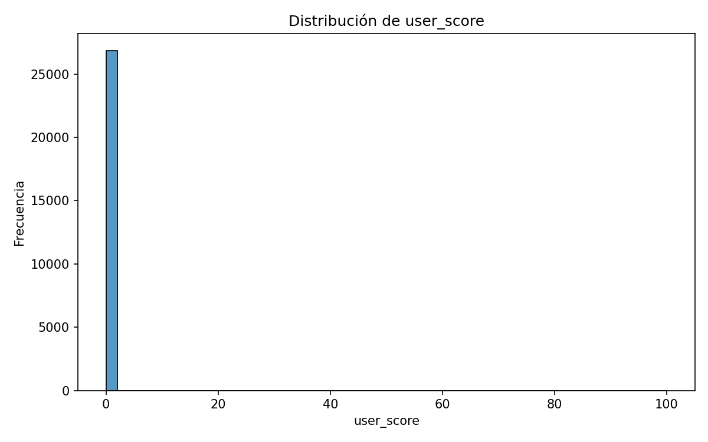
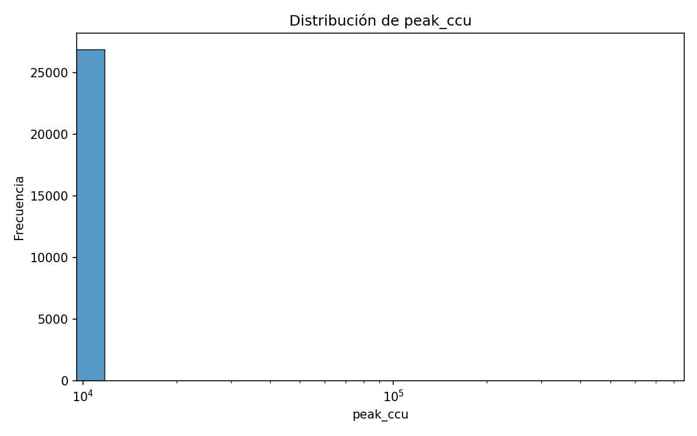
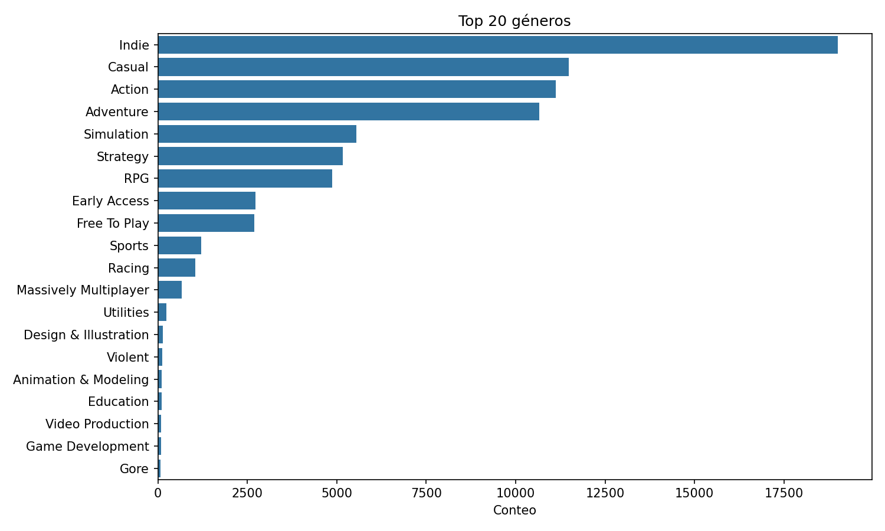

# 04 · EDA (Análisis Exploratorio de Datos)

Este módulo contiene el análisis exploratorio del dataset base (Steam games) y genera tablas/figuras para entender el negocio y construir features del modelo.

---

## Dataset de entrada

- Ruta por defecto: `archive/games_march2025_cleaned.csv`  
- Columnas cuantitativas clave: `price, user_score, positive, negative, pct_pos_total, num_reviews_total, pct_pos_recent, num_reviews_recent, peak_ccu, estimated_owners, discount, average_playtime_forever, median_playtime_forever`.

---

## Cómo ejecutar

```bash
# Resúmenes/tablas
python 02_implementation/04_eda/scripts/eda_preview.py --csv archive/games_march2025_cleaned.csv

# Gráficas y correlaciones
python 02_implementation/04_eda/scripts/eda_plots.py --csv archive/games_march2025_cleaned.csv --sample-frac 0.3
```

Salidas:
- Figuras en `02_implementation/04_eda/figures/`
- Tablas en `02_implementation/04_eda/tables/`

---

## Resultados y conclusiones del EDA

### 1) Correlaciones y multicolinealidad
- **Bloque de popularidad/escala**: `num_reviews_total`, `num_reviews_recent`, `positive`, `negative` y `peak_ccu` están fuertemente correlacionadas entre sí (miden tamaño/atención).  
  → Para modelos lineales, evita usarlas todas a la vez (riesgo de **multicolinealidad**). Selecciona 1–2 o usa reducción (p.ej., PCA) o modelos tipo árboles.
- **Calidad vs. escala**: `pct_pos_total/pct_pos_recent` miden *sentimiento relativo*, no tamaño. Complementan a los contadores.
- **Playtime**: `average_playtime_forever` y `median_playtime_forever` están muy correlacionadas.  
  → Quédate con **mediana** por robustez (menos sensible a outliers).
- **Precio/Descuento**: correlaciones débiles con popularidad: su efecto parece **no lineal** y dependiente de contexto (género, antigüedad, F2P, etc.).

### 2) Distribuciones (forma de los datos)
- **`price`**: sesgo fuerte a la derecha; mucha masa entre 0–20 y presencia de outliers altos.  
  → Usar `log1p(price)`, separar **F2P** (price=0) y considerar recorte/winsorize en colas.
- **`discount`**: **cero-inflado** (la mayoría en 0) y picos en descuentos típicos (10,20,40,50,60,80,90).  
  → Crear `has_discount` (0/1) y `discount_bucket`.
- **`peak_ccu`**: cola larga; adecuado `log1p(peak_ccu)` o modelos robustos a long-tail.
- **`user_score`**: concentración en 0 sugiere **faltantes codificados como 0**.  
  → Tratar 0 como `NaN` y añadir `has_user_score`.

### 3) Categorías y géneros (multi-label)
- Larga cola con dominancia de `Single-player`/`Family Sharing`/`Steam Achievements` y géneros `Indie/Casual/Action/Adventure`.  
  → Usar **multi-hot Top-K** + “Other” o target/impact encoding; evitar one-hot masivo.

### 4) Recomendaciones de ingeniería de features
- Transformaciones: `log1p` para contadores (`num_reviews_*`, `peak_ccu`, `dlc_count`), elegir mediana de playtime.
- Flags: `is_f2p`, `has_discount`, `has_user_score`, `has_metacritic`, etc.
- Ratios/momentum: `positive/(positive+negative)` (si no usas `pct_pos_total`) y `num_reviews_recent/num_reviews_total`.
- Price-per-hour: `price/(median_playtime_forever/60)` para títulos de pago.

---

## Gráficas

> Las imágenes deben estar en `02_implementation/04_eda/figures/`. Se incrustan aquí con rutas relativas.

### Matriz de correlaciones


### Distribuciones clave
**Precio**  


**User score**  


**Peak CCU**  


**Descuento**  


### Contenido (multi-label)
**Top 20 géneros**  


**Top 20 categorías**  


---

## Acciones de limpieza sugeridas (para el pipeline)
1. Convertir `release_date` a `datetime` y derivar `year`, `game_age_days`.  
2. Reemplazar codificaciones especiales: `required_age = -1 → NaN` (+flag).  
3. Reinterpretar `user_score == 0` como `NaN` (+`has_user_score`).  
4. Aplicar `log1p` en contadores con long-tail y seleccionar una métrica de playtime (mediana).  
5. Generar `is_f2p`, `has_discount`, `discount_bucket`, `price_per_hour` (para juegos pagos).  
6. Codificar categorías/géneros como **Top-K multi-hot** y/o target encoding.

---

## Notas
- Usa `--nrows` o `--sample-frac` para acelerar cuando el CSV es grande.
- En modelos lineales, evalúa VIF para contadores correlacionados; en GBMs, la multicolinealidad es menos problemática pero aún conviene simplificar.
